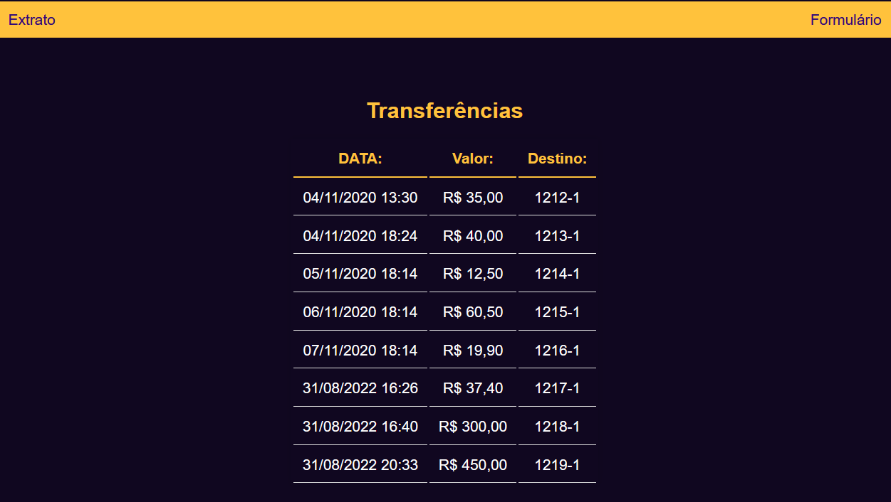
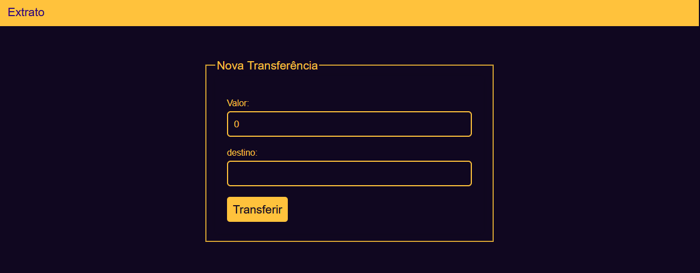
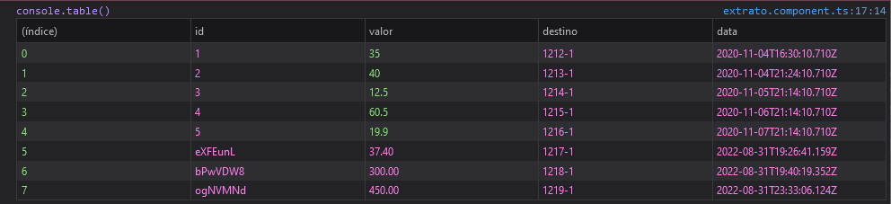

# PROJETO ANGULAR

Este projeto foi construído como base para os estudos de ANGULAR CLI, neste projeto é apresentando uma SPA que utiliza métodos modernos para criar renderização.
Neste projeto é demostrado a arquitetura do ANGULAR.
1.	Como criar componentes.
2.	Como utilizar valores de formulários nos componentes com Form Module
3.	Como utilizar OUTPUT de dados com decorador @OutPut para pegar dados do componente e enviar para outro.
4.	INPUT decorador para pegar dados de outros componentes 
5.	Usando condicionais e looping dentro do html com ngIf e NgFor
6.	Formatar Data e Valores com providers
7.	Criando SERVICES para facilitar coleta de dados entre componentes.
8.	Usando HTTPCLIENTE para solicitar requisições de páginas
9.	Usando Routers para melhorar a visualização dos componentes em diferentes processos.
### COMPONETS
Componentes são partes do código html separados e acoplados neste código foram criados 2 componentes ( extratos, formulário ) para criar novos componentes podemos executar através do CLI ou clicando direito sobre a pasta SRC e escolher criar componentes ou construi-los manualmente.
Componentes são compostos de 3 arquivos, HTML ESTILO, LÓGICA ( e Teste) 

- [ ] HTML: recebe todos processo referente as tags de marcação do código.
- [ ] ESTILO: – pode ser definido como CSS, SCSS, SASS, LESS recebe todos arquivo com dados referente a estilização final da página.
- [ ] LÓGICA: – arquivo em TypeScript que recebe todas regras e informações sobre o código.

### VISAO FINAL DO PROJETO

#### FRENTE: LISTA de TRANSFERENCIAS.

Quando o usuário entrar na página já será direcionado para o extrato de transferência, caso deseje realizar uma nova transferência poderá clicar no link Formulário.

#### VERSO: FORMULÁRIO

No formulário o cliente poderá informar o valor que deseja transferir e então informar também a qual agência deseja transferir.

---
CRIADO COM :heart: POR KAI WANG!

